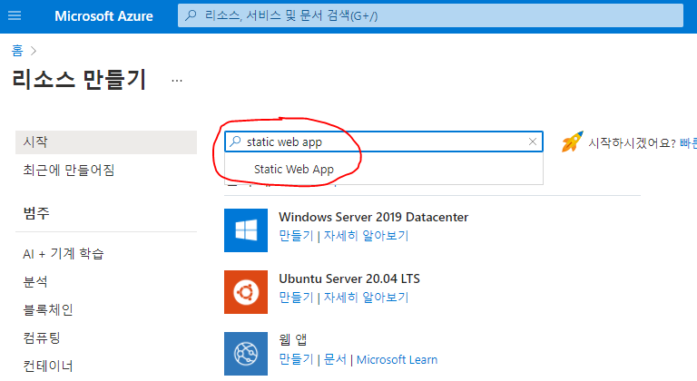

# Azure Portal로 배포하기

**본 프로젝트는 [Azure Static Web Apps](https://aka.ms/hackalearn/aswa/intro)를 통해 배포되었습니다.**

배포하기 전에 아래 사항들이 준비되었는지 확인해주세요.


## 사전 준비 사항

- **[Azure Trial 이상의 구독을 가진 Azure 계정](https://azure.microsoft.com/ko-kr/free/)**
- **[MGM 프로젝트 저장소](https://github.com/solidcellaMoon/MGMbot-HackaLearnXKorea2021)를 `fork`한 Github Repository**
  - `fork`한 저장소의 링크는 아래의 형식과 같습니다.

```
https://github.com/본인의 Github 아이디/MGMbot-HackaLearnXKorea2021
```


## Azure Static Web Apps 배포하기

1. [Azure Portal](https://portal.azure.com/#home)에 접속합니다.
2. **리소스 만들기** 를 클릭합니다.


3. 검색창에서 `Static Web App`을 입력하여 클릭하고, `만들기` 버튼을 눌러 리소스를 생성합니다.

   


4. 아래 기본 입력 사항을 확인 바랍니다.
   - `구독`: [Azure Trial](https://azure.microsoft.com/ko-kr/free/) 이상의 권한 (학생용도 가능합니다.)
   - `리소스 그룹`: 새로 만들기를 통해 만들 수 있습니다. 이름은 자유입니다.
   - `이름`: 웹앱 리소스의 이름입니다. 이름은 자유롭게 지어주세요.
   - 표시하지 않은 항목은 그대로 놔두어도 무방합니다.


5. GitHub 계정과 연동하여 저장소 받아오기

   - 스크롤을 내려 `배포 세부 정보`에서 `GitHub`을 선택합니다.
   - `GitHub로 로그인`을 클릭하여, Fork한 저장소를 보유한 계정을 연동합니다.

   

6. 빌드 세부 정보 작성하기 - 아래 사항을 확인해주세요.

   - `조직`: GitHub 아이디
   - `리포지토리`: `fork`한 저장소 이름 (fork시 기본 이름은 `MGMbot-HackaLearnXKorea2021` 입니다.)
   - `분기`: `master`
   - `빌드 사전 설정`: `Vue.js`
   - 앱 위치, API 위치, 출력 위치는 기본 양식에서 수정하지 않습니다.

   

7. 검토+만들기 를 눌러 리소스 생성하기

   - 생성이 완료되면 리소스의 `개요` 항목에서 배포 URL을 확인할 수 있습니다.

     

   - 배포 이전에는 fork한 GitHub 저장소의 `Action`에서 배포 과정이 확인 가능합니다.

   

   

